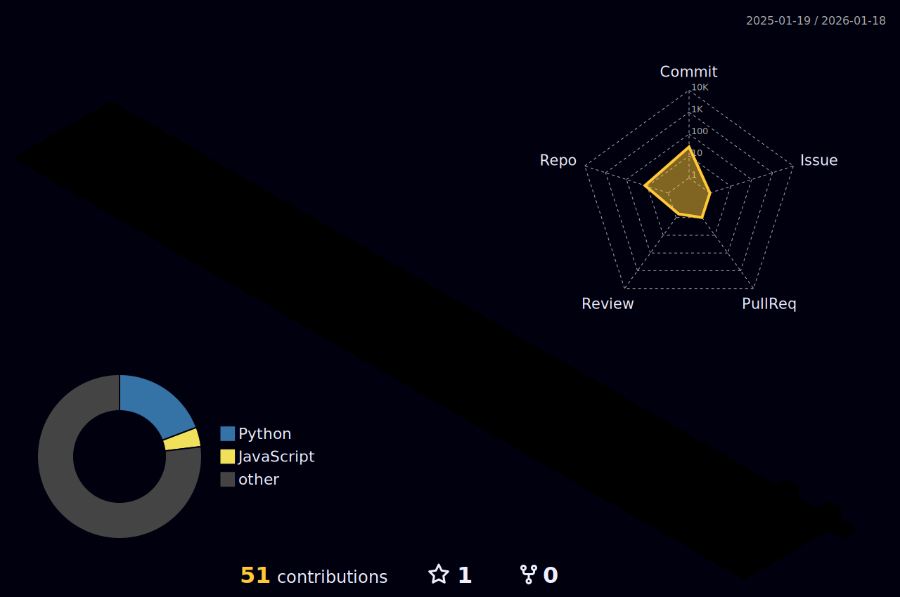

<div align="center">


<br>

# ⚡ DEADMAN

**AI Infrastructure Engineer** · **Open Source Developer** · **Intelligence Systems Architect**

<br>

> *"If it costs money, I build a free alternative."*

<br>


</div>

<br>

<table align="center">
<tr>
<td>

### 🔮 Philosophy
```
BUILD > BUY
```
Everything I create is **free**, **open source**, and **production-ready**.

</td>
<td>

### ⚙️ Stack
`Python` `TypeScript` `Lua` `Rust` `Go`
`PyTorch` `Claude` `OpenAI` `Gemini`
`Docker` `K8s` `AWS` `Cloudflare`

</td>
</tr>
</table>

<br>

<div align="center">

<picture>
  <source media="(prefers-color-scheme: dark)" srcset="./profile-3d-contrib/profile-night-rainbow.svg" />
  
</picture>

</div>

<br>

<div align="center">

### 🚀 What I Build

</div>

| Project | Description | Value |
|:--------|:------------|:------|
| [**token-optimization**](https://github.com/DeadManOfficial/token-optimization) | Drop-in LLM client with compression & caching | **30-50% cost savings** |
| [**DeadManIntelligenceCommand**](https://github.com/DeadManOfficial/DeadManIntelligenceCommand) | Autonomous intelligence gathering | **5 AI agents** |
| [**TheUnseen Framework**](https://github.com/DeadManOfficial/DeadManAI_Framework_TheUnseen) | Scalable agent network architecture | **100 agents** |
| [**claude-canvas**](https://github.com/DeadManOfficial/claude-canvas) | External display for Claude Code | **Real-time monitoring** |
| [**costco-warehouse-intelligence**](https://github.com/DeadManOfficial/costco-warehouse-intelligence) | Complete Costco database | **643 warehouses FREE** |
| [**intel-mission-control**](https://github.com/DeadManOfficial/intel-mission-control) | Operations dashboard | **NASA-style ops** |

<br>

<div align="center">

### 🎵 Currently

<a href="https://open.spotify.com/user/3133qm4wimam7vxe3kttlljjcld4">
  
</a>

<br><br>

---

<br>

**Every repository. One creator. Zero cost.**

[GitHub](https://github.com/DeadManOfficial) · [X](https://twitter.com/DeadManAI)

</div>
